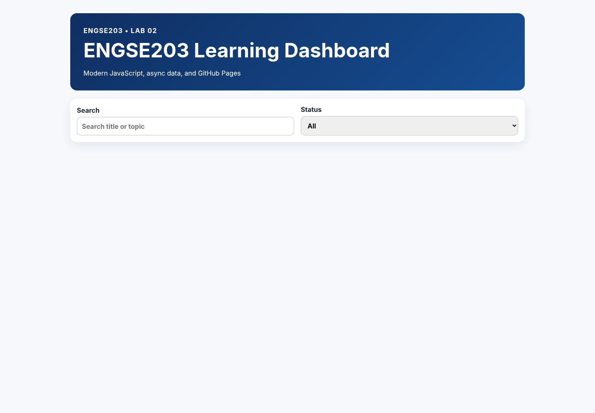
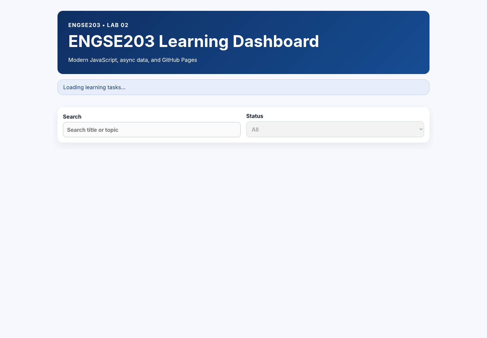
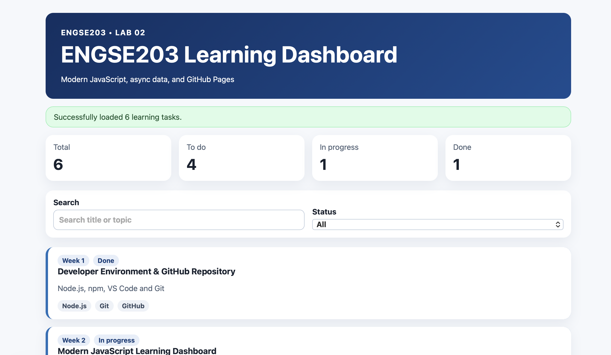
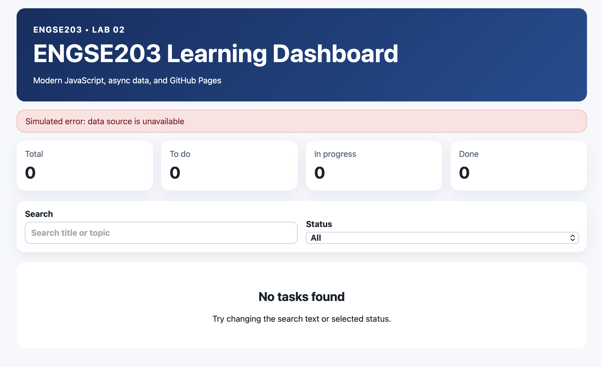
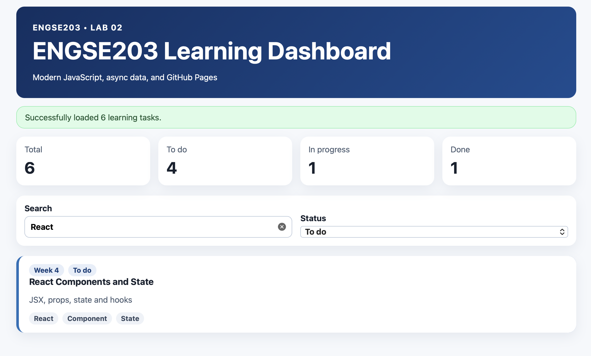
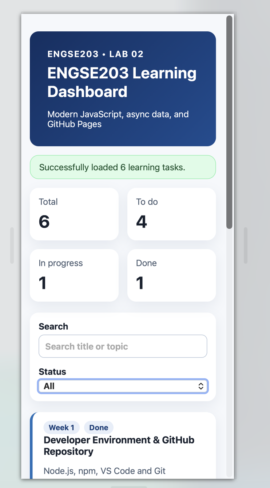
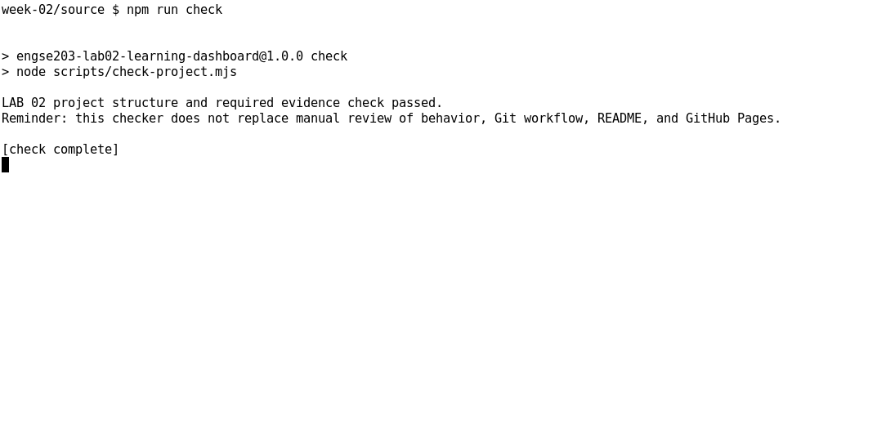
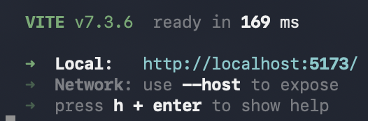

# Week 02 Evidence

ควรมี screenshots ของ initial/loading/success/error/filter/mobile และผล `npm run check` / `npm run build`

## Initial State

## Loading State

## Success State

## Error State

## Filter

## Mobile Responsive

## npm run check

## npm run build

